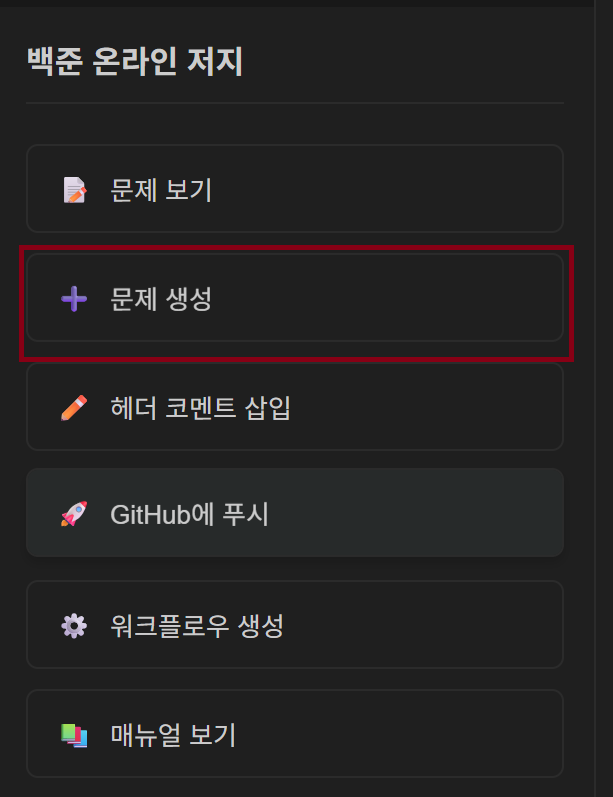
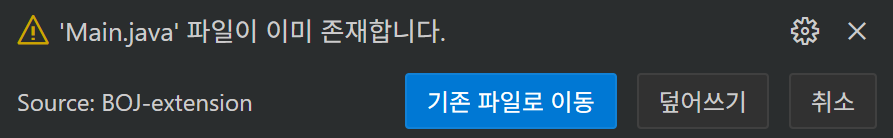

## 참고사항

본 repo는 BOJ EXTENSION을 기반으로 작성되었습니다.

해당 vscode extension은 백준 기반의 각 문제별로 테스트 지원, 문제 생성 자동화 등을 지원하여 해당 기능을 활용해 백준의 제출전 모아두는 repo입니다.

만약 해당 Extension을 활용하신다면, 문제 생성을 백준 문제번호로 검색 시, 이미 파일이 존재한다고 뜨며 해당 번호로 이동할 수 있습니다.

